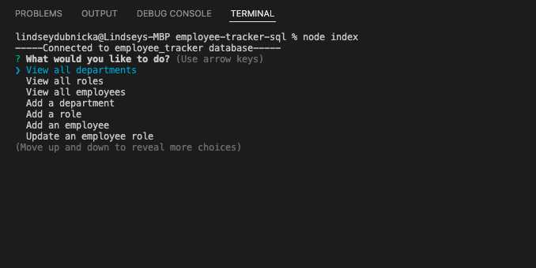
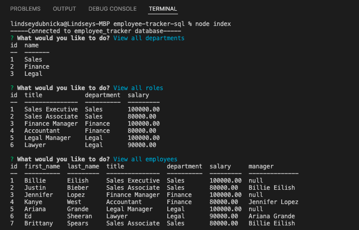
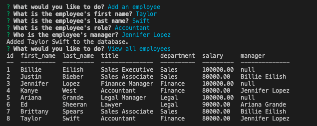

# Employee Tracker

## Description
The employee tracker is a command-line application for managing a company's employee database. The application allows a user to view, create, and update their employees, roles and departments.  
  
## Installation
This application uses Node.js, Inquirer, Console Table and MySQL. To install necessary dependencies, run the following command: 
```
npm install
```

## Usage
After installing the necessary dependencies, the application will be invoked from the command line by entering: `node index`
The screen shots below will give you an idea of how this application should work, or checkout the video link below to get a step-by-step demo. <br />
https://drive.google.com/file/d/1gP6JgZhDk2b4xtYMWhOHPY2eO2lezl8a/view?usp=sharing 

Start the application and choose a menu item: <br />
 <br />
<br />
View all the tables in the database: <br />
 <br />
<br />
Add an employee to the database: <br />


## Questions
Feel free to reach out to me for any questions or comments. <br/>
Link to my GitHub: github.com/lindseymiller2567